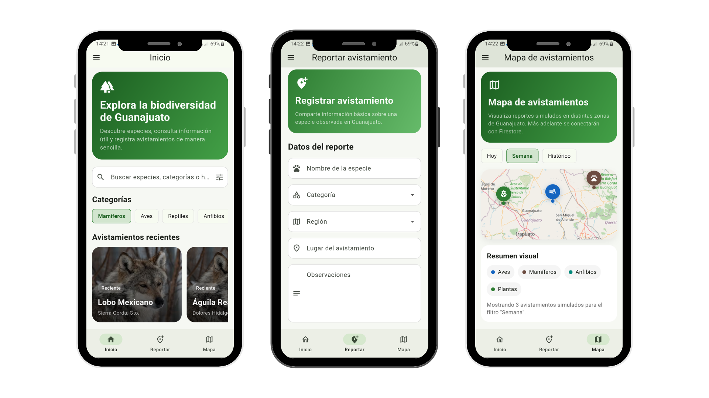

# 🌿 Flutter Biodiversity App

Aplicación móvil multiplataforma diseñada para la exploración de especies y el registro de avistamientos en el estado de Guanajuato.

---

## 📱 Preview




---

## 🎬 Demo

<p align="center">
  
</p>


## 🧭 Contexto del proyecto

Este proyecto surge durante un proceso de formación en Flutter, mientras participaba como promotor de educación ambiental.

A partir de la necesidad de contar con un recurso digital interactivo para exposiciones, talleres y actividades educativas, se planteó el desarrollo de una aplicación que permitiera:

- Visualizar especies del estado de Guanajuato  
- Acercar la biodiversidad a estudiantes y público general  
- Documentar avistamientos de manera accesible  

Aunque inicialmente el proyecto no fue concluido, esta versión representa una reconstrucción del concepto original, llevada a un MVP funcional con enfoque en diseño de producto y experiencia de usuario.

---

## 🧠 Enfoque de producto

Antes de ser una implementación técnica, esta aplicación fue pensada como un producto digital:

- enfoque en **experiencia visual e interacción**
- navegación clara y accesible
- estructura pensada para usuarios no técnicos (niños, estudiantes, público general)
- escalabilidad hacia una herramienta educativa más robusta

Este proyecto refleja un proceso donde el diseño y la intención del producto preceden al desarrollo técnico.

---

## 🚀 Features

- 🔐 Autenticación de usuarios (Firebase Auth)
- 🧭 Navegación estructurada (Bottom Navigation + Drawer)
- 🐾 Catálogo de especies en formato Grid
- 📄 Vista de detalle tipo ficha técnica
- 📝 Registro de avistamientos
- ☁️ Persistencia de datos en Cloud Firestore
- 🗺️ Vista de mapa (estructura base)
- 📊 Visualización de reportes del usuario

---

## 🧱 Tech Stack


---

## 🧠 Arquitectura

La aplicación sigue una arquitectura simple tipo MVP:

- Flutter como frontend  
- Firebase como backend  
- Firestore para persistencia de datos  

---

## 🔄 Flujo de usuario


```text
Login → Home → Explorar especies → Detalle → Reportar → Mis reportes

````


## 🔮 Evolución del proyecto


Este proyecto representa una primera iteración (MVP).


Se plantea su evolución en:


👉 **Flutter Biodiversity App v2 (Byemmidev)**


Con enfoque en:


* arquitectura más robusta
* backend estructurado
* integración con APIs externas
* reconocimiento de especies
* mejoras avanzadas de UX


---


## 🛠️ Instalación


```bash
git clone https://github.com/Norahs211/Flutter-Biodiversity-App.git
cd Flutter-Biodiversity-App
flutter pub get
flutter run
```


---


## 🔐 Seguridad


Las claves visibles en el proyecto corresponden a configuración cliente de Firebase.
El acceso a datos está protegido mediante autenticación y reglas de Firestore.


---


## 📂 Estructura del proyecto


```text
lib/
├── auth/
├── data/
├── models/
├── screens/
├── services/
└── widgets/
```


---


## 👤 Autor


**Norash211**


Proyecto desarrollado como práctica y reconstrucción de una idea original enfocada en educación ambiental, diseño de producto y desarrollo multiplataforma.


---


## ⭐ Notas


Este proyecto forma parte de un proceso de evolución hacia aplicaciones más completas, centradas en experiencia de usuario, arquitectura y escalabilidad.


